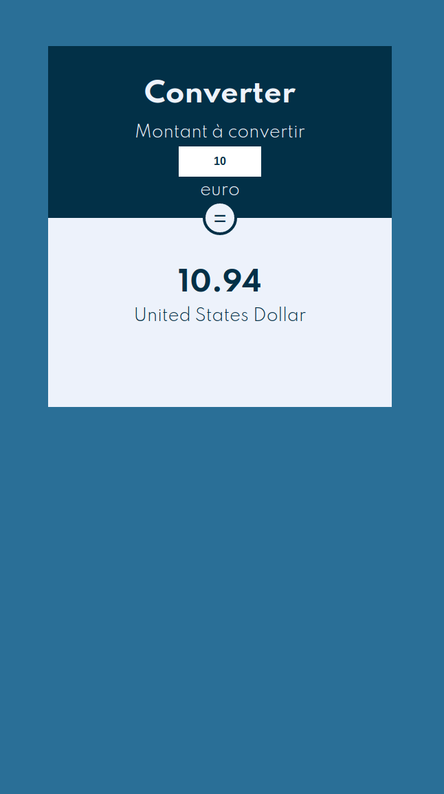
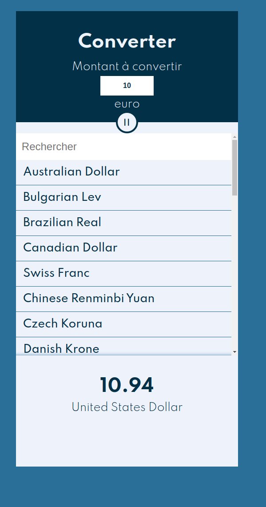
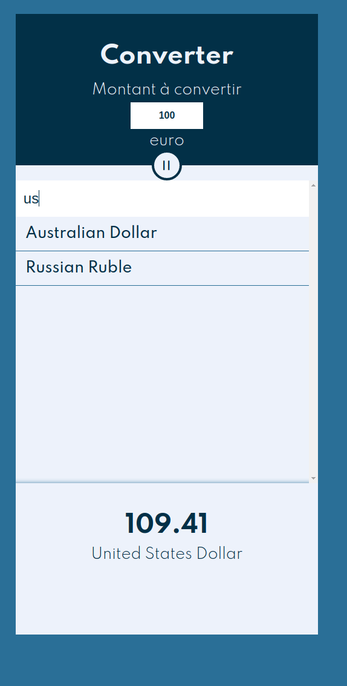

# cp3 converter devise React without store

## projet deploiement
[www.cp3.henriteinturier.fr](http://www.cp3.henriteinturier.fr)

## aperçu

## installe les dépendances du projet
yarn 

## lance le serveur de developpement
yarn start 

## rdv sur http://localhost:8080/
